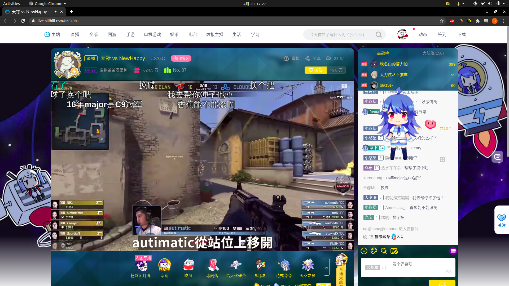
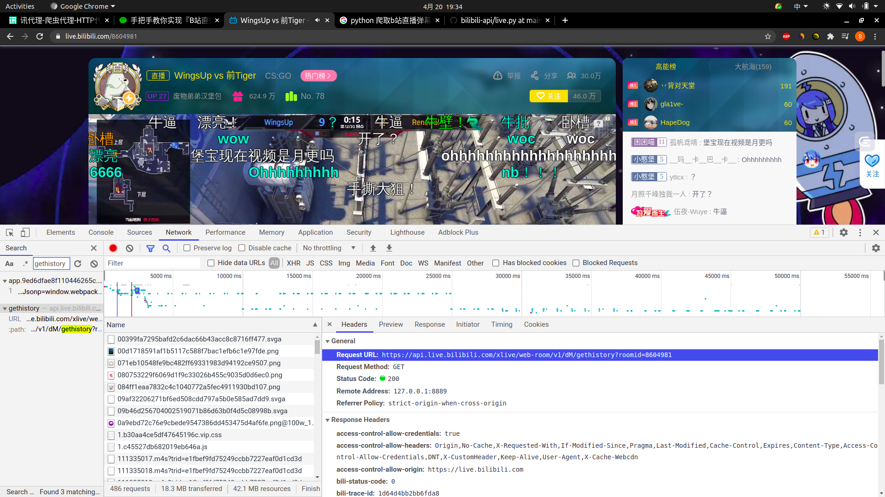

# readme

采集直播弹幕，然后通过情感分析，不同时间点的评论数，高频词统计

## 采集直播弹幕

随便打开一个直播间

```shell
https://live.bilibili.com/8604981
```



房间号：8604981

### 查找弹幕链接

查看 network，找到以下链接

```shell
https://api.live.bilibili.com/xlive/web-room/v1/dM/gethistory?roomid=8604981
```



可以看到是 post 请求，经过验证只需要房间号就可以获取弹幕

构造请求，并存储数据

```python
# -*- coding:utf-8 -*-


import operator
import time
import random
import json
import pandas
import requests
import snownlp

headers = {
    'Accept-Encoding': 'gzip, deflate, sdch',
    'Accept-Language': 'en-US,en;q=0.8',
    'User-Agent': 'Mozilla/5.0 (X11; Linux x86_64) AppleWebKit/537.36 (KHTML, like Gecko) Chrome/90.0.4430.72 Safari/537.36',
    'Accept': 'text/html,application/xhtml+xml,application/xml;q=0.9,image/webp,*/*;q=0.8',
    'Connection': 'keep-alive',
    "Host": "api.live.bilibili.com"
}
roomId = "8604981"
url = "https://api.live.bilibili.com/xlive/web-room/v1/dM/gethistory?roomid=8604981"


def gain_data():
    """

    :return:
    """
    r = requests.post(url, headers=headers)
    '''key'''
    ''''text', 'uid', 'nickname', 'timeline', 'isadmin' '''
    print(r.json())


if __name__ == '__main__':
    """"""
    gain_data()
```

结果为：

```json
{
  'code': 0,
  'data': {
    'admin': [
      {
        'text': '能赢！',
        'uid': 5845141,
        'nickname': '警大的Coldzera本人',
        'uname_color': '#00D1F1',
        'timeline': '2021-04-20 18:49:08',
        'isadmin': 1,
        'vip': 0,
        'svip': 0,
        'medal': [
          25,
          '小憨堡',
          '废物弟弟汉堡包',
          8604981,
          398668,
          '',
          0,
          6809855,
          398668,
          6850801,
          3,
          1,
          507694
        ],
        'title': [
          '',
          ''
        ],
        'user_level': [
          18,
          0,
          6406234,
          '>50000'
        ],
        'rank': 10000,
        'teamid': 0,
        'rnd': '437215725',
        'user_title': '',
        'guard_level': 3,
        'bubble': 5,
        'bubble_color': '#1453BAFF,#4C2263A2,#3353BAFF',
        'check_info': {
          'ts': 1618915748,
          'ct': '938DCC6F'
        },
        'lpl': 0
      },
      {
        'text': 'nice',
        'uid': 10469116,
        'nickname': '今天也一样颓废的猪蹄',
        'uname_color': '#00D1F1',
        'timeline': '2021-04-20 18:54:41',
        'isadmin': 1,
        'vip': 0,
        'svip': 0,
        'medal': [
          27,
          '小憨堡',
          '废物弟弟汉堡包',
          8604981,
          398668,
          '',
          0,
          6809855,
          398668,
          6850801,
          3,
          1,
          507694
        ],
        'title': [
          '',
          ''
        ],
        'user_level': [
          21,
          0,
          5805790,
          '>50000'
        ],
        'rank': 10000,
        'teamid': 0,
        'rnd': '1618912530',
        'user_title': '',
        'guard_level': 3,
        'bubble': 5,
        'bubble_color': '#1453BAFF,#4C2263A2,#3353BAFF',
        'check_info': {
          'ts': 1618916081,
          'ct': 'BDB49BC5'
        },
        'lpl': 0
      },
      {
        'text': 'Wingsup牛逼',
        'uid': 5845141,
        'nickname': '警大的Coldzera本人',
        'uname_color': '#00D1F1',
        'timeline': '2021-04-20 18:54:49',
        'isadmin': 1,
        'vip': 0,
        'svip': 0,
        'medal': [
          25,
          '小憨堡',
          '废物弟弟汉堡包',
          8604981,
          398668,
          '',
          0,
          6809855,
          398668,
          6850801,
          3,
          1,
          507694
        ],
        'title': [
          '',
          ''
        ],
        'user_level': [
          18,
          0,
          6406234,
          '>50000'
        ],
        'rank': 10000,
        'teamid': 0,
        'rnd': '-166485721',
        'user_title': '',
        'guard_level': 3,
        'bubble': 5,
        'bubble_color': '#1453BAFF,#4C2263A2,#3353BAFF',
        'check_info': {
          'ts': 1618916089,
          'ct': '2605F37A'
        },
        'lpl': 0
      },
      {
        'text': 'Kkrj',
        'uid': 5845141,
        'nickname': '警大的Coldzera本人',
        'uname_color': '#00D1F1',
        'timeline': '2021-04-20 19:02:55',
        'isadmin': 1,
        'vip': 0,
        'svip': 0,
        'medal': [
          25,
          '小憨堡',
          '废物弟弟汉堡包',
          8604981,
          398668,
          '',
          0,
          6809855,
          398668,
          6850801,
          3,
          1,
          507694
        ],
        'title': [
          '',
          ''
        ],
        'user_level': [
          18,
          0,
          6406234,
          '>50000'
        ],
        'rank': 10000,
        'teamid': 0,
        'rnd': '836806596',
        'user_title': '',
        'guard_level': 3,
        'bubble': 5,
        'bubble_color': '#1453BAFF,#4C2263A2,#3353BAFF',
        'check_info': {
          'ts': 1618916575,
          'ct': 'A89E8EFD'
        },
        'lpl': 0
      },
      {
        'text': 'NTR！',
        'uid': 5845141,
        'nickname': '警大的Coldzera本人',
        'uname_color': '#00D1F1',
        'timeline': '2021-04-20 19:10:26',
        'isadmin': 1,
        'vip': 0,
        'svip': 0,
        'medal': [
          25,
          '小憨堡',
          '废物弟弟汉堡包',
          8604981,
          398668,
          '',
          0,
          6809855,
          398668,
          6850801,
          3,
          1,
          507694
        ],
        'title': [
          '',
          ''
        ],
        'user_level': [
          18,
          0,
          6406234,
          '>50000'
        ],
        'rank': 10000,
        'teamid': 0,
        'rnd': '-579223658',
        'user_title': '',
        'guard_level': 3,
        'bubble': 5,
        'bubble_color': '#1453BAFF,#4C2263A2,#3353BAFF',
        'check_info': {
          'ts': 1618917026,
          'ct': '8DD54B41'
        },
        'lpl': 0
      },
      {
        'text': '讨论比赛',
        'uid': 5845141,
        'nickname': '警大的Coldzera本人',
        'uname_color': '#00D1F1',
        'timeline': '2021-04-20 19:25:33',
        'isadmin': 1,
        'vip': 0,
        'svip': 0,
        'medal': [
          25,
          '小憨堡',
          '废物弟弟汉堡包',
          8604981,
          398668,
          '',
          0,
          6809855,
          398668,
          6850801,
          3,
          1,
          507694
        ],
        'title': [
          '',
          ''
        ],
        'user_level': [
          18,
          0,
          6406234,
          '>50000'
        ],
        'rank': 10000,
        'teamid': 0,
        'rnd': '336460836',
        'user_title': '',
        'guard_level': 3,
        'bubble': 5,
        'bubble_color': '#1453BAFF,#4C2263A2,#3353BAFF',
        'check_info': {
          'ts': 1618917933,
          'ct': 'AB1C00AB'
        },
        'lpl': 0
      },
      {
        'text': '有隐患啊',
        'uid': 5845141,
        'nickname': '警大的Coldzera本人',
        'uname_color': '#00D1F1',
        'timeline': '2021-04-20 19:29:12',
        'isadmin': 1,
        'vip': 0,
        'svip': 0,
        'medal': [
          25,
          '小憨堡',
          '废物弟弟汉堡包',
          8604981,
          398668,
          '',
          0,
          6809855,
          398668,
          6850801,
          3,
          1,
          507694
        ],
        'title': [
          '',
          ''
        ],
        'user_level': [
          18,
          0,
          6406234,
          '>50000'
        ],
        'rank': 10000,
        'teamid': 0,
        'rnd': '1140962768',
        'user_title': '',
        'guard_level': 3,
        'bubble': 5,
        'bubble_color': '#1453BAFF,#4C2263A2,#3353BAFF',
        'check_info': {
          'ts': 1618918152,
          'ct': 'DE149766'
        },
        'lpl': 0
      },
      {
        'text': 'Ct不稳的，经济还是很危险',
        'uid': 5845141,
        'nickname': '警大的Coldzera本人',
        'uname_color': '#00D1F1',
        'timeline': '2021-04-20 19:31:32',
        'isadmin': 1,
        'vip': 0,
        'svip': 0,
        'medal': [
          25,
          '小憨堡',
          '废物弟弟汉堡包',
          8604981,
          398668,
          '',
          0,
          6809855,
          398668,
          6850801,
          3,
          1,
          507694
        ],
        'title': [
          '',
          ''
        ],
        'user_level': [
          18,
          0,
          6406234,
          '>50000'
        ],
        'rank': 10000,
        'teamid': 0,
        'rnd': '574442069',
        'user_title': '',
        'guard_level': 3,
        'bubble': 5,
        'bubble_color': '#1453BAFF,#4C2263A2,#3353BAFF',
        'check_info': {
          'ts': 1618918292,
          'ct': 'C7CD8535'
        },
        'lpl': 0
      },
      {
        'text': '沃日这比赛也有片总来？',
        'uid': 5845141,
        'nickname': '警大的Coldzera本人',
        'uname_color': '#00D1F1',
        'timeline': '2021-04-20 19:33:15',
        'isadmin': 1,
        'vip': 0,
        'svip': 0,
        'medal': [
          25,
          '小憨堡',
          '废物弟弟汉堡包',
          8604981,
          398668,
          '',
          0,
          6809855,
          398668,
          6850801,
          3,
          1,
          507694
        ],
        'title': [
          '',
          ''
        ],
        'user_level': [
          18,
          0,
          6406234,
          '>50000'
        ],
        'rank': 10000,
        'teamid': 0,
        'rnd': '-1782349530',
        'user_title': '',
        'guard_level': 3,
        'bubble': 5,
        'bubble_color': '#1453BAFF,#4C2263A2,#3353BAFF',
        'check_info': {
          'ts': 1618918395,
          'ct': 'ADEB4BB0'
        },
        'lpl': 0
      },
      {
        'text': '还好，还有经济',
        'uid': 5845141,
        'nickname': '警大的Coldzera本人',
        'uname_color': '#00D1F1',
        'timeline': '2021-04-20 19:36:45',
        'isadmin': 1,
        'vip': 0,
        'svip': 0,
        'medal': [
          25,
          '小憨堡',
          '废物弟弟汉堡包',
          8604981,
          398668,
          '',
          0,
          6809855,
          398668,
          6850801,
          3,
          1,
          507694
        ],
        'title': [
          '',
          ''
        ],
        'user_level': [
          18,
          0,
          6406234,
          '>50000'
        ],
        'rank': 10000,
        'teamid': 0,
        'rnd': '-670524394',
        'user_title': '',
        'guard_level': 3,
        'bubble': 5,
        'bubble_color': '#1453BAFF,#4C2263A2,#3353BAFF',
        'check_info': {
          'ts': 1618918605,
          'ct': 'E0C4F180'
        },
        'lpl': 0
      }
    ],
    'room': [
      {
        'text': '？？？',
        'uid': 50793301,
        'nickname': '灿烂星空下的低语',
        'uname_color': '',
        'timeline': '2021-04-20 19:39:00',
        'isadmin': 0,
        'vip': 0,
        'svip': 0,
        'medal': [
          10,
          '小憨堡',
          '废物弟弟汉堡包',
          8604981,
          9272486,
          '',
          0,
          12632256,
          12632256,
          12632256,
          0,
          0,
          507694
        ],
        'title': [
          '',
          ''
        ],
        'user_level': [
          3,
          0,
          9868950,
          '>50000'
        ],
        'rank': 10000,
        'teamid': 0,
        'rnd': '1618918698',
        'user_title': '',
        'guard_level': 0,
        'bubble': 0,
        'bubble_color': '',
        'check_info': {
          'ts': 1618918740,
          'ct': '89BA306F'
        },
        'lpl': 0
      },
      {
        'text': '奶？',
        'uid': 11471780,
        'nickname': '夜黎巫',
        'uname_color': '',
        'timeline': '2021-04-20 19:39:00',
        'isadmin': 0,
        'vip': 0,
        'svip': 0,
        'medal': [
          2,
          '呆兮兮',
          '月兮Channel',
          22625077,
          6067854,
          '',
          0,
          6067854,
          6067854,
          6067854,
          0,
          1,
          606293627
        ],
        'title': [
          '',
          ''
        ],
        'user_level': [
          16,
          0,
          6406234,
          '>50000'
        ],
        'rank': 10000,
        'teamid': 0,
        'rnd': '1928565031',
        'user_title': '',
        'guard_level': 0,
        'bubble': 0,
        'bubble_color': '',
        'check_info': {
          'ts': 1618918740,
          'ct': '6242C6A0'
        },
        'lpl': 0
      },
      {
        'text': '饭桶  吃了睡是吧',
        'uid': 12041989,
        'nickname': '灰色粉尘-',
        'uname_color': '',
        'timeline': '2021-04-20 19:39:00',
        'isadmin': 0,
        'vip': 0,
        'svip': 0,
        'medal': [
          10,
          '福酱',
          '大福福福福福福福福哟',
          1321579,
          9272486,
          '',
          0,
          9272486,
          9272486,
          9272486,
          0,
          1,
          9183966
        ],
        'title': [
          '',
          ''
        ],
        'user_level': [
          23,
          0,
          5805790,
          '>50000'
        ],
        'rank': 10000,
        'teamid': 0,
        'rnd': '1618910848',
        'user_title': '',
        'guard_level': 0,
        'bubble': 0,
        'bubble_color': '',
        'check_info': {
          'ts': 1618918740,
          'ct': '48A46EEE'
        },
        'lpl': 0
      },
      {
        'text': '狂奶',
        'uid': 1577893,
        'nickname': '零崎桑',
        'uname_color': '',
        'timeline': '2021-04-20 19:39:00',
        'isadmin': 0,
        'vip': 0,
        'svip': 0,
        'medal': [
          17,
          '猛男',
          '两仪滚',
          5096,
          13081892,
          '',
          0,
          13081892,
          13081892,
          13081892,
          0,
          1,
          183430
        ],
        'title': [
          '',
          ''
        ],
        'user_level': [
          22,
          0,
          5805790,
          '>50000'
        ],
        'rank': 10000,
        'teamid': 0,
        'rnd': '1618921077',
        'user_title': '',
        'guard_level': 0,
        'bubble': 0,
        'bubble_color': '',
        'check_info': {
          'ts': 1618918740,
          'ct': 'E6CD6E59'
        },
        'lpl': 0
      },
      {
        'text': '宝宝开始奶了',
        'uid': 435960696,
        'nickname': 'VP的yekindar本人',
        'uname_color': '',
        'timeline': '2021-04-20 19:39:01',
        'isadmin': 0,
        'vip': 0,
        'svip': 0,
        'medal': [
          13,
          '小憨堡',
          '废物弟弟汉堡包',
          8604981,
          12478086,
          '',
          0,
          12478086,
          12478086,
          12478086,
          0,
          1,
          507694
        ],
        'title': [
          '',
          ''
        ],
        'user_level': [
          11,
          0,
          6406234,
          '>50000'
        ],
        'rank': 10000,
        'teamid': 0,
        'rnd': '448127023',
        'user_title': '',
        'guard_level': 0,
        'bubble': 0,
        'bubble_color': '',
        'check_info': {
          'ts': 1618918741,
          'ct': 'F1D6378A'
        },
        'lpl': 0
      },
      {
        'text': '饭桶谁这么早？',
        'uid': 34569789,
        'nickname': '好吧我佛了',
        'uname_color': '',
        'timeline': '2021-04-20 19:39:01',
        'isadmin': 0,
        'vip': 0,
        'svip': 0,
        'medal': [
          1,
          '汉卿',
          '敬汉卿',
          920309,
          6067854,
          '',
          0,
          12632256,
          12632256,
          12632256,
          0,
          0,
          9824766
        ],
        'title': [
          '',
          ''
        ],
        'user_level': [
          0,
          0,
          9868950,
          '>50000'
        ],
        'rank': 10000,
        'teamid': 0,
        'rnd': '-896224431',
        'user_title': '',
        'guard_level': 0,
        'bubble': 0,
        'bubble_color': '',
        'check_info': {
          'ts': 1618918741,
          'ct': '1D1BF'
        },
        'lpl': 0
      },
      {
        'text': '直播时长？',
        'uid': 8890998,
        'nickname': '清酒-醆',
        'uname_color': '',
        'timeline': '2021-04-20 19:39:02',
        'isadmin': 0,
        'vip': 0,
        'svip': 0,
        'medal': [
          3,
          '小憨堡',
          '废物弟弟汉堡包',
          8604981,
          6067854,
          '',
          0,
          6067854,
          6067854,
          6067854,
          0,
          1,
          507694
        ],
        'title': [
          '',
          ''
        ],
        'user_level': [
          20,
          0,
          6406234,
          '>50000'
        ],
        'rank': 10000,
        'teamid': 0,
        'rnd': '1618916573',
        'user_title': '',
        'guard_level': 0,
        'bubble': 0,
        'bubble_color': '',
        'check_info': {
          'ts': 1618918742,
          'ct': 'C5075BC3'
        },
        'lpl': 0
      },
      {
        'text': '？饭桶',
        'uid': 23716825,
        'nickname': '-抢救一下-',
        'uname_color': '',
        'timeline': '2021-04-20 19:39:02',
        'isadmin': 0,
        'vip': 0,
        'svip': 0,
        'medal': [
          11,
          'ASAKI',
          'Asaki大人',
          6154037,
          9272486,
          '',
          0,
          9272486,
          9272486,
          9272486,
          0,
          1,
          194484313
        ],
        'title': [
          '',
          ''
        ],
        'user_level': [
          5,
          0,
          9868950,
          '>50000'
        ],
        'rank': 10000,
        'teamid': 0,
        'rnd': '1618916272',
        'user_title': '',
        'guard_level': 0,
        'bubble': 0,
        'bubble_color': '',
        'check_info': {
          'ts': 1618918742,
          'ct': 'CE960FC6'
        },
        'lpl': 0
      },
      {
        'text': '啊不是斗地主十万豆子',
        'uid': 13848360,
        'nickname': '以沫苏颜丶',
        'uname_color': '',
        'timeline': '2021-04-20 19:39:04',
        'isadmin': 0,
        'vip': 0,
        'svip': 0,
        'medal': [
          21,
          'Yema',
          '-野马的野-',
          22896825,
          1725515,
          '',
          0,
          6809855,
          1725515,
          5414290,
          3,
          1,
          170501937
        ],
        'title': [
          '',
          ''
        ],
        'user_level': [
          37,
          0,
          10512625,
          46652
        ],
        'rank': 10000,
        'teamid': 0,
        'rnd': '1618917017',
        'user_title': '',
        'guard_level': 0,
        'bubble': 0,
        'bubble_color': '',
        'check_info': {
          'ts': 1618918744,
          'ct': '4B4EE0CB'
        },
        'lpl': 0
      },
      {
        'text': '不愧是你',
        'uid': 456518201,
        'nickname': '不爱晒太阳的蜗牛',
        'uname_color': '',
        'timeline': '2021-04-20 19:39:05',
        'isadmin': 0,
        'vip': 0,
        'svip': 0,
        'medal': [
          1,
          '水有月',
          '水无月菌',
          1370218,
          6067854,
          '',
          0,
          12632256,
          12632256,
          12632256,
          0,
          0,
          1958342
        ],
        'title': [
          '',
          ''
        ],
        'user_level': [
          0,
          0,
          9868950,
          '>50000'
        ],
        'rank': 10000,
        'teamid': 0,
        'rnd': '1618918400',
        'user_title': '',
        'guard_level': 0,
        'bubble': 0,
        'bubble_color': '',
        'check_info': {
          'ts': 1618918745,
          'ct': '4C5FF3DB'
        },
        'lpl': 0
      }
    ]
  },
  'message': '',
  'msg': ''
}
```

我们提取 ```'uid', 'nickname', 'timeline', 'text', 'isadmin'``` 字段

首先构造一个含有该字段的字典：

```python
data = {
    'uid': list(),
    'nickname': list(),
    'timeline': list(),
    'text': list(),
    'isadmin': list()
}
data_list = [
    'uid', 'nickname', 'timeline', 'text', 'isadmin'
]
```

将数据存入

```python
def gain_data():
    """

    :return:
    """
    r = requests.post(url, headers=headers)
    '''key'''
    ''''text', 'uid', 'nickname', 'timeline', 'isadmin' '''
    admin = r.json()["data"]["admin"]
    room = r.json()["data"]["room"]
    for ad in admin:
        for dl in data_list:
            data[dl].append(ad[dl])
    for ro in room:
        for dl in data_list:
            data[dl].append(ro[dl])


if __name__ == '__main__':
    """"""
    gain_data()
    print(data)
```

结果为：

```json
{
  'uid': [
    5845141,
    10469116,
    5845141,
    5845141,
    5845141,
    5845141,
    5845141,
    5845141,
    5845141,
    5845141,
    20467084,
    535300587,
    16072024,
    65434218,
    448813875,
    454066427,
    305675016,
    18017448,
    6475466,
    604258763
  ],
  'nickname': [
    '警大的Coldzera本人',
    '今天也一样颓废的猪蹄',
    '警大的Coldzera本人',
    '警大的Coldzera本人',
    '警大的Coldzera本人',
    '警大的Coldzera本人',
    '警大的Coldzera本人',
    '警大的Coldzera本人',
    '警大的Coldzera本人',
    '警大的Coldzera本人',
    '妈妈说名字长很拽',
    '饭捅',
    '寒沭_',
    '做个饭桶挺好',
    '问君何思',
    '余盈',
    '青春臺北',
    'BOSS-EEC',
    'NaiL連二三',
    '艾伦口壹嗝儿'
  ],
  'timeline': [
    '2021-04-20 18:49:08',
    '2021-04-20 18:54:41',
    '2021-04-20 18:54:49',
    '2021-04-20 19:02:55',
    '2021-04-20 19:10:26',
    '2021-04-20 19:25:33',
    '2021-04-20 19:29:12',
    '2021-04-20 19:31:32',
    '2021-04-20 19:33:15',
    '2021-04-20 19:36:45',
    '2021-04-20 19:42:39',
    '2021-04-20 19:42:40',
    '2021-04-20 19:42:41',
    '2021-04-20 19:42:41',
    '2021-04-20 19:42:41',
    '2021-04-20 19:42:42',
    '2021-04-20 19:42:44',
    '2021-04-20 19:42:45',
    '2021-04-20 19:42:45',
    '2021-04-20 19:42:45'
  ],
  'text': [
    '能赢！',
    'nice',
    'Wingsup牛逼',
    'Kkrj',
    'NTR！',
    '讨论比赛',
    '有隐患啊',
    'Ct不稳的，经济还是很危险',
    '沃日这比赛也有片总来？',
    '还好，还有经济',
    '阿这',
    '片总考虑上个舰吗',
    '有音乐，舒服了',
    'burger这太多片哥了',
    '来了来了',
    '为啥要保护，不举报吗',
    '片总上舰片总上舰',
    '有内味了',
    '踩点了',
    'bgm是啥'
  ],
  'isadmin': [
    1,
    1,
    1,
    1,
    1,
    1,
    1,
    1,
    1,
    1,
    0,
    0,
    0,
    0,
    0,
    0,
    0,
    0,
    0,
    0
  ]
}
```

## 采集与保存

每隔几秒请求一次，这里也可以设置最大爬取次数

```python
MAX = 10


def save_msg():
    """

    :return:
    """
    i = 0
    while True and i != MAX:
        time.sleep(random.randint(4, 6))
        gain_data()
        i += 1
    '''csv'''
    pandas.DataFrame(data).to_csv("resource/bilibili/bilibili_data.csv", encoding="utf-8")
    '''json'''
    with open("resource/bilibili/bilibili_data.json", "w", encoding="utf-8") as f:
        f.write(json.dumps(data, ensure_ascii=False))
```

将数据保存到 json 和 csv 文件中

## 情感分析

情绪判断，返回值为正面情绪的概率，越接近 1 表示正面情绪，越接近 0 表示负面情绪

先简单来看一个例子

```python
text1 = '不会真的有人不喜欢这部电影吧'
s1 = snownlp.SnowNLP(text1)
print(text1, s1.sentiments)
```

结果为：

```
不会真的有人不喜欢这部电影吧 0.8058788755871523
```

比较有意思的是，把第二个不去了，结果会更高。。。

通过 snownlp 库实现文本的情感分析

```python
def analysis_data():
    """

    :return:
    """
    with open("resource/bilibili/bilibili_data.json", "r") as f:
        d = json.load(f)
    d["text_analysis"] = list()
    count1, count2 = 0, 0
    for text in d["text"]:
        t = snownlp.SnowNLP(text)
        if t.sentiments > 0.5:
            d["text_analysis"].append(1)
            count1 += 1
        else:
            d["text_analysis"].append(-1)
            count2 += 1
    print("count1 : ", count1, "\t count2 : ", count2)
```

结果为：

```text
count1 :  90 	 count2 :  110
```

## 高频词统计

思路：通过 snownlp 库对文本(弹幕)进行分词然后会分好的词进行统计排序

先将弹幕合并成文本

开始进行统计，然后取出前 10

```python
text = "".join(d["text"])
s = snownlp.SnowNLP(text)
dict_word = dict()
s_word = s.words
for it in s_word:
    dict_word[it] = s_word.count(it)
dict_word = sorted(dict_word.items(), key=operator.itemgetter(1), reverse=True)[:10]
for t in dict_word:
    print(t[0], "\t", t[1])
```

结果为：

```text
， 	 30
还 	 20
不 	 20
桶 	 20
是 	 20
下播 	 20
呢 	 20
好 	 10
还有 	 10
经济 	 10
```

当然我们也可以根据弹幕文本和 snownlp 库做更多的处理和分析

[源码](bilibili_barrage.py)
