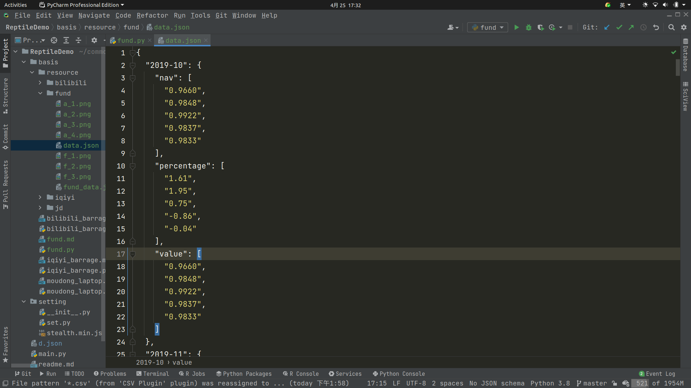

# readme

## 采集基金


### 分析

首先是页面，这里选择了蛋卷基金网页去采集数据

```text
https://danjuanapp.com/funding/161725?channel=1300100141
```

其中白酒基金的代号是：161725

查看数据包可以发现，这里网页是通过异步加载数据，那接下就好办了


可知访问链接是

```text
https://danjuanapp.com/djapi/fund/nav/history/161725?page=1&size=5
```


通过改变代号161725，和size，可以获取不同基金的最新多少条数据

### 编程实现

首先通过 requests 请求数据，code 是对应的基金代号，这里161725 是白酒基金，size 是对应的数据量

```python
# -*- coding:utf-8 -*-

import json
import matplotlib.pyplot as plt
import requests

headers = {
    'Accept-Encoding': 'gzip, deflate, sdch',
    'Accept-Language': 'en-US,en;q=0.8',
    'User-Agent': 'Mozilla/5.0 (X11; Linux x86_64) AppleWebKit/537.36 (KHTML, like Gecko) Chrome/90.0.4430.72 Safari/537.36',
    'Accept': 'text/html,application/xhtml+xml,application/xml;q=0.9,image/webp,*/*;q=0.8',
    'Connection': 'keep-alive',
}

code = 161725
size = 365
url = "https://danjuanapp.com/djapi/fund/nav/history/" + str(code) + "?page=1&size=" + str(size)


def gain_data():
    """

    :return:
    """
    res = requests.get(url, headers=headers)
    res.encoding = "utf-8"
    '''json'''
    with open("resource/fund/fund_data.json", "w", encoding="utf-8") as f:
        f.write(json.dumps(res.json(), ensure_ascii=False))
```

获取到数据后。按从以前到现在（倒叙）打印，并且按月分开

```python
def test_data():
    """

    :return:
    """

    def print_msg(d: dict):
        """

        :param d:
        :return:
        """
        print('date: ', d["date"], '\tnav: ', d["nav"], '\tpercentage: ', d["percentage"], '\tvalue: ', d["value"])

    '''json'''
    with open("resource/fund/fund_data.json", "r") as f:
        data = json.load(f)["data"]["items"]
    l = len(data)
    now = data[l - 1]["date"].split("-")[1]
    for i in range(l - 1, -1, -1):
        d = data[i]
        m = d["date"].split("-")[1]
        if m == now:
            print_msg(d)
        else:
            print("------")
            now = m
            print_msg(d)
```

结果为:

```text
date:  2019-10-25 	nav:  0.9660 	percentage:  1.61 	value:  0.9660
date:  2019-10-28 	nav:  0.9848 	percentage:  1.95 	value:  0.9848
date:  2019-10-29 	nav:  0.9922 	percentage:  0.75 	value:  0.9922
date:  2019-10-30 	nav:  0.9837 	percentage:  -0.86 	value:  0.9837
date:  2019-10-31 	nav:  0.9833 	percentage:  -0.04 	value:  0.9833
------
date:  2019-11-01 	nav:  0.9949 	percentage:  1.18 	value:  0.9949
date:  2019-11-04 	nav:  1.0021 	percentage:  0.72 	value:  1.0021
date:  2019-11-05 	nav:  1.0043 	percentage:  0.22 	value:  1.0043
date:  2019-11-06 	nav:  0.9933 	percentage:  -1.1 	value:  0.9933
date:  2019-11-07 	nav:  1.0012 	percentage:  0.8 	value:  1.0012
date:  2019-11-08 	nav:  1.0050 	percentage:  0.38 	value:  1.0050
date:  2019-11-11 	nav:  0.9951 	percentage:  -0.99 	value:  0.9951
date:  2019-11-12 	nav:  0.9986 	percentage:  0.35 	value:  0.9986
date:  2019-11-13 	nav:  1.0052 	percentage:  0.66 	value:  1.0052
date:  2019-11-14 	nav:  1.0158 	percentage:  1.05 	value:  1.0158
date:  2019-11-15 	nav:  1.0093 	percentage:  -0.64 	value:  1.0093
date:  2019-11-18 	nav:  1.0048 	percentage:  -0.45 	value:  1.0048
...
```

## 可视化

### 预处理

以月为跨度整合数据

```python
def deal_data():
    """

    :return:
    """
    '''json'''
    with open("resource/fund/fund_data.json", "r") as f:
        data = json.load(f)["data"]["items"]
    new_data = dict()
    l = len(data)
    now = " "
    for i in range(l - 1, -1, -1):
        d = data[i]
        m = d["date"].split("-")[1]
        tmp = d["date"].split("-")
        month = tmp[0] + "-" + tmp[1]
        if m == now:
            new_data[month]["nav"].append(d["nav"])
            new_data[month]["percentage"].append(d["percentage"])
            new_data[month]["value"].append(d["value"])
        else:
            now = m
            new_data[month] = dict()
            new_data[month]["nav"] = list()
            new_data[month]["percentage"] = list()
            new_data[month]["value"] = list()
            new_data[month]["nav"].append(d["nav"])
            new_data[month]["percentage"].append(d["percentage"])
            new_data[month]["value"].append(d["value"])
    '''json'''
    with open("resource/fund/data.json", "w", encoding="utf-8") as f:
        f.write(json.dumps(new_data, ensure_ascii=False))
```

结果为：



### 月初和月末对比

```python
def analysis_one():
    """

    :return:
    """
    '''json'''
    with open("resource/fund/data.json", "r") as f:
        data = json.load(f)
    month = list()
    month_start = list()
    month_end = list()
    for key, value in data.items():
        month.append(key)
        l = len(value["value"])
        month_start.append(float(value["value"][0]))
        month_end.append(float(value["value"][l - 1]))
    ''''''
    bar_width = 0.25
    x = list(range(len(month)))
    xTicks = [i + bar_width for i in x]
    plt.figure(figsize=(20, 8), dpi=100)
    plt.bar(x, month_start, width=bar_width, label="Beginning of month")
    plt.bar(xTicks, month_end, width=bar_width, label="End of month")
    plt.xlabel("month")
    plt.ylabel("value")
    plt.xticks(xTicks, month)
    plt.legend()
    plt.savefig("resource/fund/a_1.png")
    plt.show()
```

结果图：


### 当月最高涨和最低跌

```python
def analysis_two():
    """

    :return:
    """
    '''json'''
    with open("resource/fund/data.json", "r") as f:
        data = json.load(f)
    month = list()
    month_high = list()
    month_low = list()
    for key, value in data.items():
        month.append(key)
        month_high.append(float(max(value["value"])))
        month_low.append(-float(min(value["value"])))
    ''''''
    bar_width = 0.25
    x = list(range(len(month)))
    xTicks = [i + bar_width for i in x]
    plt.figure(figsize=(20, 8), dpi=100)
    plt.bar(x, month_high, width=bar_width, label="Highest of month")
    plt.bar(xTicks, month_low, width=bar_width, label="Lowest of month")
    plt.xlabel("month")
    plt.ylabel("value")
    plt.xticks(xTicks, month)
    plt.legend()
    plt.savefig("resource/fund/a_2.png")
    plt.show()
```

结果图：


### 当月波动值(最高涨和最低跌之差)

```python
def analysis_three():
    """

    :return:
    """
    '''json'''
    with open("resource/fund/data.json", "r") as f:
        data = json.load(f)
    month = list()
    month_value = list()
    for key, value in data.items():
        month.append(key)
        month_value.append(float(max(value["value"])) - float(min(value["value"])))
    ''''''
    plt.figure(figsize=(20, 8), dpi=100)
    plt.plot(month, month_value, label="diff")
    plt.xlabel("month")
    plt.ylabel("value")
    plt.legend()
    plt.savefig("resource/fund/a_3.png")
    plt.show()
```

结果图：


### 月差值(月末减月初，该月是否盈亏)

```python
def analysis_four():
    """

    :return:
    """
    '''json'''
    with open("resource/fund/data.json", "r") as f:
        data = json.load(f)
    month = list()
    month_value = list()
    for key, value in data.items():
        month.append(key)
        l = len(value["value"])
        month_value.append(float(value["value"][l - 1]) - float(value["value"][0]))
    ''''''
    plt.figure(figsize=(20, 8), dpi=100)
    plt.plot(month, month_value, label="diff")
    plt.xlabel("month")
    plt.ylabel("value")
    plt.legend()
    plt.savefig("resource/fund/a_4.png")
    plt.show()
```


也可以根据得到的数据做一些其他的分析

[源码](fund.py)