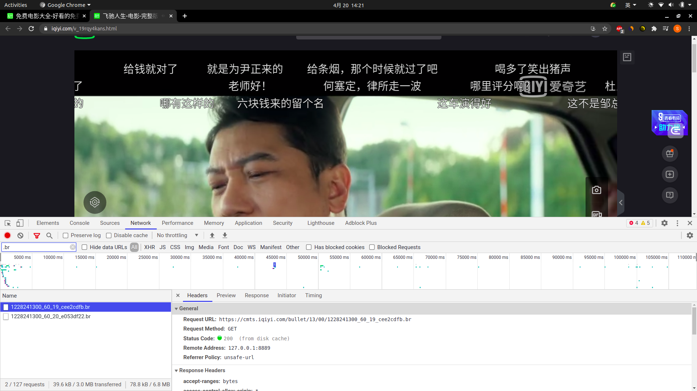
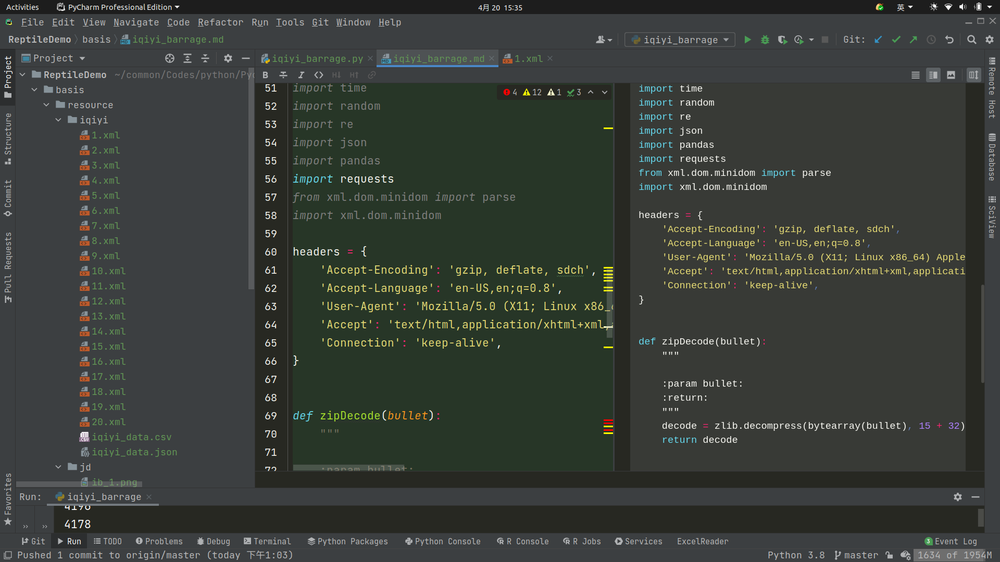
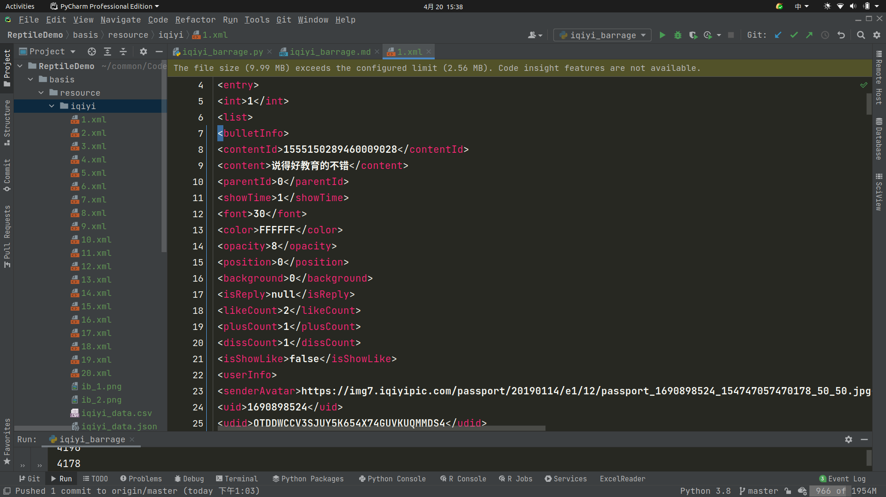
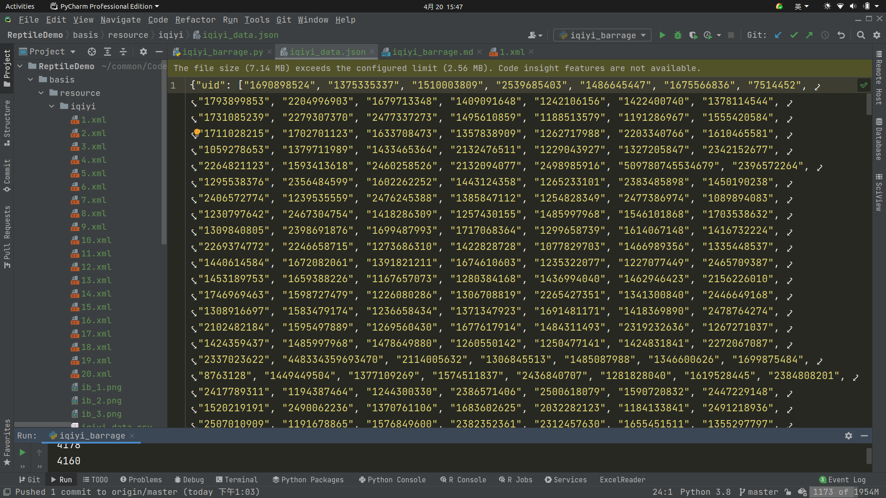
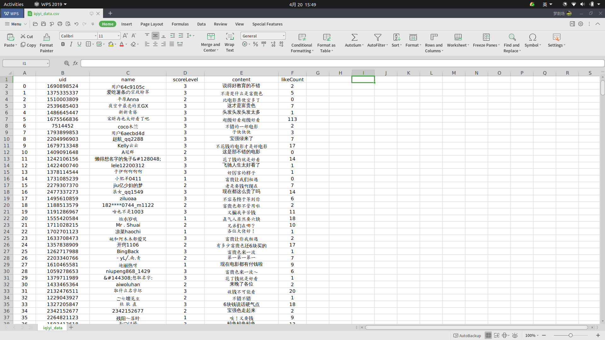

# readme

爬取爱奇艺《飞驰人生》弹幕

## 分析数据包

打开浏览器，进入电影《飞驰人生》播放页，进入 network



找到 url

```shell
https://cmts.iqiyi.com/bullet/13/00/1228241300_60_19_cee2cdfb.br
```

## 分析链接

其中的/13/00/1228241300，才是有用的

爱奇艺的弹幕获取地址如下：

```shell
https://cmts.iqiyi.com/bullet/参数1_300_参数2.z
```

参数1是：/13/00/1228241300

参数2是：数字1、2、3.....

爱奇艺每5分钟会加载新的弹幕，该电影有 98 分钟

因此弹幕的链接如下：

```shell
https://cmts.iqiyi.com/bullet//13/00/1228241300_300_1.z
https://cmts.iqiyi.com/bullet//13/00/1228241300_300_2.z
...
https://cmts.iqiyi.com/bullet//13/00/1228241300_300_20.z
```

## 解码二进制数据包

通过弹幕链接下载的弹幕包是以z为后缀格式的文件，需要进行解码

```python
# -*- coding:utf-8 -*-


import zlib
import time
import random
import re
import json
import pandas
import requests
from xml.dom.minidom import parse
import xml.dom.minidom

headers = {
    'Accept-Encoding': 'gzip, deflate, sdch',
    'Accept-Language': 'en-US,en;q=0.8',
    'User-Agent': 'Mozilla/5.0 (X11; Linux x86_64) AppleWebKit/537.36 (KHTML, like Gecko) Chrome/90.0.4430.72 Safari/537.36',
    'Accept': 'text/html,application/xhtml+xml,application/xml;q=0.9,image/webp,*/*;q=0.8',
    'Connection': 'keep-alive',
}
num = 20


def zipDecode(bullet):
    """

    :param bullet:
    :return:
    """
    decode = zlib.decompress(bytearray(bullet), 15 + 32).decode("utf-8")
    return decode


def download_xml(url: str):
    """

    :param url:
    :return:
    """
    r = requests.get(url, headers=headers).content
    return zipDecode(r)
```

解码之后将数据保存为 xml 格式

```python
def load_data():
    """

    :return:
    """
    for i in range(1, num + 1):
        time.sleep(random.randint(6, 10) / 10)
        url = "https://cmts.iqiyi.com/bullet/13/00/1228241300_300_" + str(i) + ".z"
        xml = download_xml(url)
        with open("resource/iqiyi/" + str(i) + ".xml", "a+", encoding="utf-8") as f:
            f.write(xml)
```

结果为：



## 解析 xml



从 xml 文件可以发现，我们需要的信息被包含在一对 ```<link></link>``` 里

一方面可以使用 xml 库进行提取，但是这里提取失败了，另一方面可以使用正则表达式

定义一个字典保持数据：

```python
data = {
    "uid": list(),
    "name": list(),
    "scoreLevel": list(),
    "content": list(),
    "likeCount": list()
}
```

### 使用 xml 库

```python
def load_xml_old():
    """

    :return:
    """
    for i in range(1, num + 1):
        f = "resource/iqiyi/" + str(i) + ".xml"
        domTree = xml.dom.minidom.parse(f)
        collection = domTree.documentElement
        '''在集合中获取所有 entry 数据'''
        entries = collection.getElementsByTagName("entry")
        for entry in entries:
            uid = entry.getElementsByTagName('uid')[0]
            content = entry.getElementsByTagName('content')[0]
            likeCount = entry.getElementsByTagName('likeCount')[0]
            name = entry.getElementsByTagName('name')[0]
            scoreLevel = entry.getElementsByTagName('scoreLevel')[0]
            data["uid"].append(str(uid.childNodes[0].data))
            data["content"].append(str(content.childNodes[0].data))
            data["likeCount"].append(str(likeCount.childNodes[0].data))
            data["name"].append(str(name.childNodes[0].data))
            data["scoreLevel"].append(str(scoreLevel.childNodes[0].data))
```

报错了

```text
...
xml.parsers.expat.ExpatError: junk after document element: line 60358, column 0
```

### 使用正则表达式

```python
def load_xml():
    """

    :return:
    """
    for i in range(1, num + 1):
        f = "resource/iqiyi/" + str(i) + ".xml"
        r = open(f, "r").read()
        uid_list = re.findall('<uid>(.*?)</uid>', r, re.S)
        content_list = re.findall('<content>(.*?)</content>', r, re.S)
        likeCount_list = re.findall('<likeCount>(.*?)</likeCount>', r, re.S)
        name_list = re.findall('<name>(.*?)</name>', r, re.S)
        scoreLevel_list = re.findall('<scoreLevel>(.*?)</scoreLevel>', r, re.S)
        data["uid"].extend(uid_list)
        data["content"].extend(content_list)
        data["likeCount"].extend(likeCount_list)
        data["name"].extend(name_list)
        data["scoreLevel"].extend(scoreLevel_list)
        print(len(scoreLevel_list))
```

## 保存数据

```python
if __name__ == '__main__':
    """"""
    load_data()
    # load_xml_old()
    load_xml()
    '''csv'''
    pandas.DataFrame(data).to_csv("resource/iqiyi/iqiyi_data.csv", encoding="utf-8")
    '''json'''
    with open("resource/iqiyi/iqiyi_data.json", "w", encoding="utf-8") as f:
```

写入 json



写入 csv



[源码](iqiyi_barrage.py)