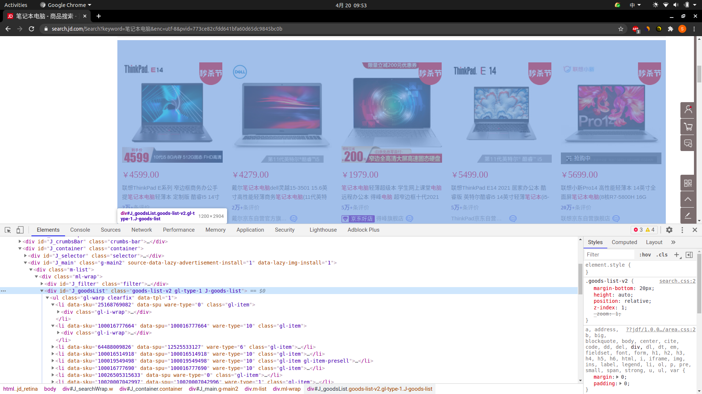
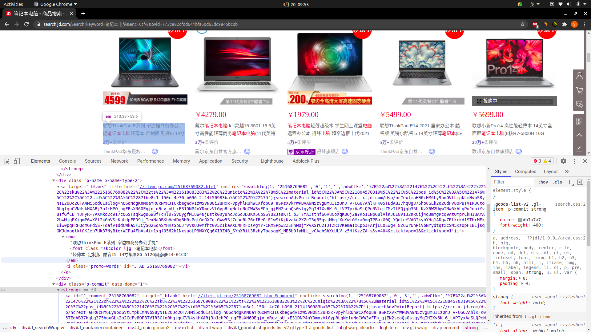
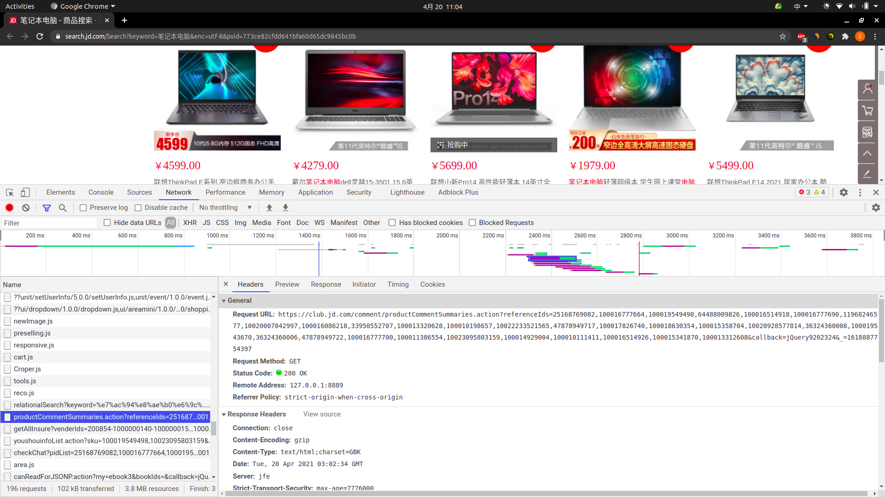
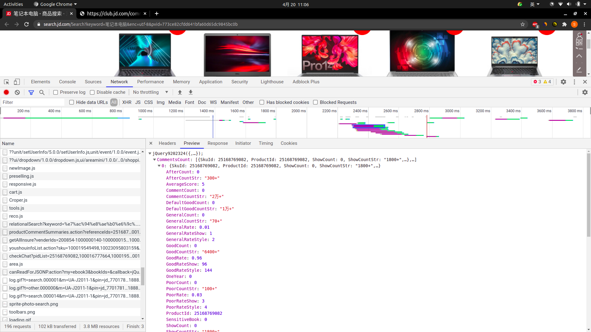
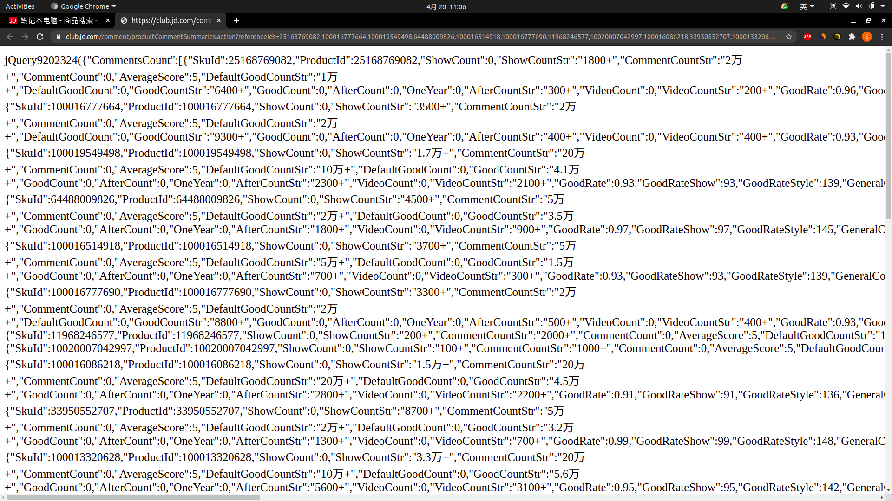
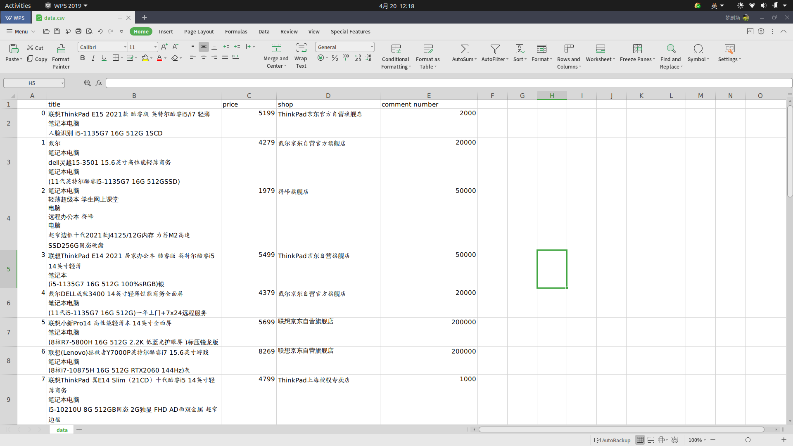
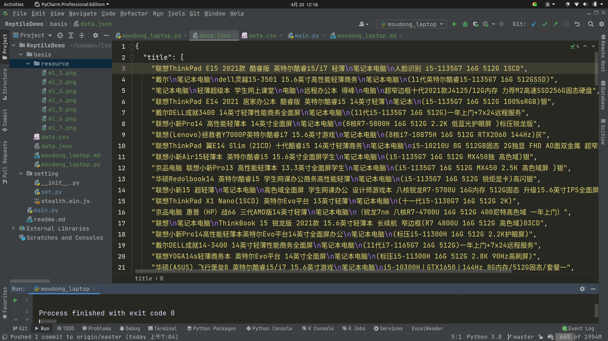
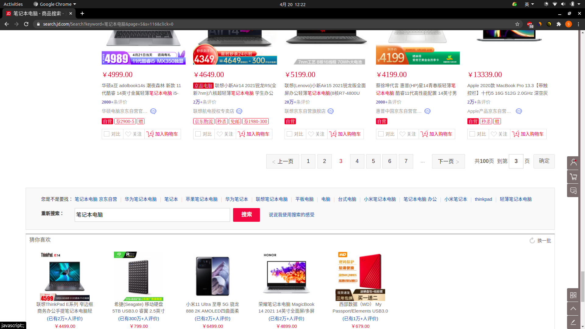

# readme

某东爬取案例

## 查看网页

搜索框输入：笔记本


链接如下

```shell
https://search.jd.com/Search?keyword=%E7%AC%94%E8%AE%B0%E6%9C%AC%E7%94%B5%E8%84%91&enc=utf-8&pvid=773ce82cfdd641bfa60d65dc9845bc0b
```

需要爬取

* 商品名称
* 商品价格
* 商品评论数

## 分析网页标签

### 获取当前网页所有商品



可以看到在 class 标签 id=J_goodsList 里 ul -> li ,对应着所有商品列表

### 获取商品具体属性



每一个 li（商品）标签中，class=p-name p-name-type-2 对应商品标题，class=p-price 对应商品价格，class=p-commit 对应商品 ID（方便后面获取评论数）

这里商品评论数不能直接在网页上获取，需要根据商品ID去获取

## 爬取数据

### 实现

```python
# -*- coding:utf-8 -*-

import pandas
import time
import random
import re
import json
import requests
from pyquery import PyQuery


headers = {
    'Accept-Encoding': 'gzip, deflate, sdch',
    'Accept-Language': 'en-US,en;q=0.8',
    'User-Agent': 'Mozilla/5.0 (X11; Linux x86_64) AppleWebKit/537.36 (KHTML, like Gecko) Chrome/90.0.4430.72 Safari/537.36',
    'Accept': 'text/html,application/xhtml+xml,application/xml;q=0.9,image/webp,*/*;q=0.8',
    'Connection': 'keep-alive',
}


def gain_msg(url: str):
    """
    
    :param url:
    :return:
    """
    r = requests.get(url, headers=headers)
    r.encoding = "utf-8"
    content = PyQuery(r.text)("#J_goodsList")("ul")("li")
    for d in content.items():
        print("title = ", d(".p-name.p-name-type-2")("em").text())
        print("price = ", d(".p-price")("i").text())
        print("product_id = ", d.attr("data-sku"))
        print("shop = ", d(".p-shop")("a").text())
        print("------")


if __name__ == '__main__':
    """"""
    url = "https://search.jd.com/Search?keyword=%E7%AC%94%E8%AE%B0%E6%9C%AC%E7%94%B5%E8%84%91&enc=utf-8&pvid=773ce82cfdd641bfa60d65dc9845bc0b"
    gain_msg(url)
```

结果为:

```text
title =  联想ThinkPad E15 2021款 酷睿版 英特尔酷睿i5/i7 轻薄
笔记本电脑
人脸识别 i5-1135G7 16G 512G 1SCD
price =  5199.00
product_id =  10026505315633
shop =  ThinkPad京东官方自营旗舰店
------
title =  戴尔
笔记本电脑
dell灵越15-3501 15.6英寸高性能轻薄商务
笔记本电脑
(11代英特尔酷睿i5-1135G7 16G 512GSSD)
price =  4279.00
product_id =  100016777664
shop =  戴尔京东自营官方旗舰店
------
...
```

内容太多，省略了一大部分

## 获取商品评论数

查看 network，找到如下数据包



将该 url 链接放到浏览器里面可以获取到商品评论数





分析该 url

```shell
https://club.jd.com/comment/productCommentSummaries.action?referenceIds=25168769082,100016777664,100019549498,64488009826,100016514918,100016777690,11968246577,10020007042997,100016086218,33950552707,100013320628,100010198657,10022233521565,47878949717,100017826740,100018630354,100015358704,10020928577814,36324360008,100019543670,36324360006,47878949722,100016777700,100011386554,10023095803159,100014929004,100010111411,100016514926,100015341870,100013312608&callback=jQuery9202324&_=1618887754397
```

referenceIds 就是商品 id，product_id

根据商品ID（可以同时多个ID一起获取）获取商品评论数 CommentCountStr

最后我们可以将获取商品评论数的方法封装成一个函数

此外，我们可以发现在获取到的评论数包含“万”“+”等符号，需要进行相应处理

```python
def comment_count(product_id: str):
    """
    根据商品id获取评论数
    :param product_id:
    :return:
    """
    time.sleep(random.randint(4, 10) / 10)
    url = "https://club.jd.com/comment/productCommentSummaries.action?referenceIds=" + str(
        product_id) + "&callback=jQuery9202324&_=1618887754397"
    res = requests.get(url, headers=headers)
    res.encoding = 'utf-8'
    text = re.findall("jQuery9202324\((.*)\)", res.text, re.S)[0]
    text = json.loads(text)
    comment_count = text['CommentsCount'][0]['CommentCountStr']
    '''对 + 进行操作'''
    comment_count = comment_count.replace("+", "")
    '''对 万 进行操作'''
    if "万" in comment_count:
        comment_count = comment_count.replace("万", "")
        comment_count = str(int(comment_count) * 10000)
    return comment_count


if __name__ == '__main__':
    """"""
    print(comment_count(10026505315633))
```

结果为：

```
200000
```

## 写入到文件中

### 整理数据

先将数据写入到字典中，键是

* 商品名称
* 价格
* 店铺
* 评论数 

值是一个列表

```python
data = {
    "title": list(),
    "price": list(),
    "shop": list(),
    "comment number": list()
}


def gain_msg(url: str):
    """
    
    :param url:
    :return:
    """
    r = requests.get(url, headers=headers)
    r.encoding = "utf-8"
    content = PyQuery(r.text)("#J_goodsList")("ul")("li")
    for d in content.items():
        title = d(".p-name.p-name-type-2")("em").text()
        price = d(".p-price")("i").text()
        shop = d(".p-shop")("a").text()
        comment_num = comment_count(d.attr("data-sku"))
        data["title"].append(title)
        data["shop"].append(shop)
        data["price"].append(price)
        data["comment number"].append(comment_num)


if __name__ == '__main__':
    """"""
    url = "https://search.jd.com/Search?keyword=%E7%AC%94%E8%AE%B0%E6%9C%AC%E7%94%B5%E8%84%91&enc=utf-8&pvid=773ce82cfdd641bfa60d65dc9845bc0b"
    gain_msg(url)
    '''csv'''
    print(data)
    pandas.DataFrame(data).to_csv("resource/jd_data.csv")
    '''json'''
    with open("resource/jd/jd_data.json", "w") as f:
        f.write(json.dumps(data))
```

将数据保存为 csv 文件



将数据保存为 json 文件



## 翻页

### 分析下一页

这里的下一页与平常看到的不一样




可以发现

|页数|page||s| |:----:|:----:|:----:| |第一页|1|1| |第二页|3|56| |第三页|5|116| |第四页|7|176| |第五页|9|236|

翻页规律可能会变，目前，第一页 page 和 s 都是1，从第二页开始，page 加 2，s 从 56 开始，加 60

翻页如下:

```python
def get_page():
    """

    :return:
    """
    num = 6
    page = 1
    s = 1
    for i in range(1, num):
        if i == 1:
            url = "https://search.jd.com/Search?keyword=%E7%AC%94%E8%AE%B0%E6%9C%AC%E7%94%B5%E8%84%91&page=" + str(
                1) + "&s=" + str(1) + "+&click=0"
        else:
            url = "https://search.jd.com/Search?keyword=%E7%AC%94%E8%AE%B0%E6%9C%AC%E7%94%B5%E8%84%91&page=" + str(
                page) + "&s=" + str(s) + "+&click=0"
        print("page=" + str(page) + ",s=" + str(s))
        gain_msg(url)
        page = page + 2
        s = s + 60
        if i == 1:
            s = 56
```

这样就可以爬每一页了

[源码](code/moudong_laptop.py)