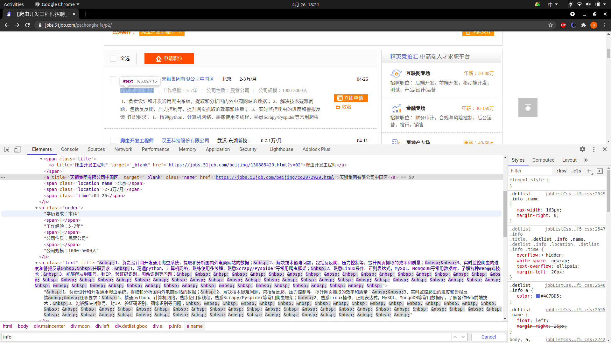
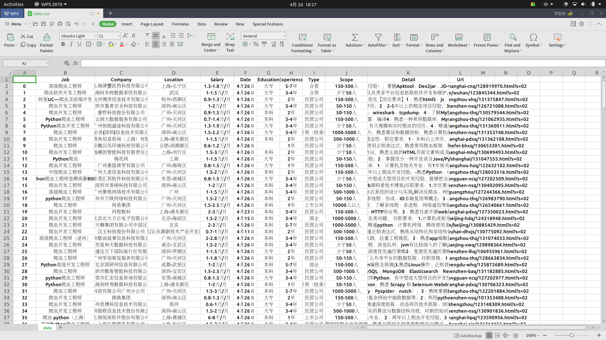
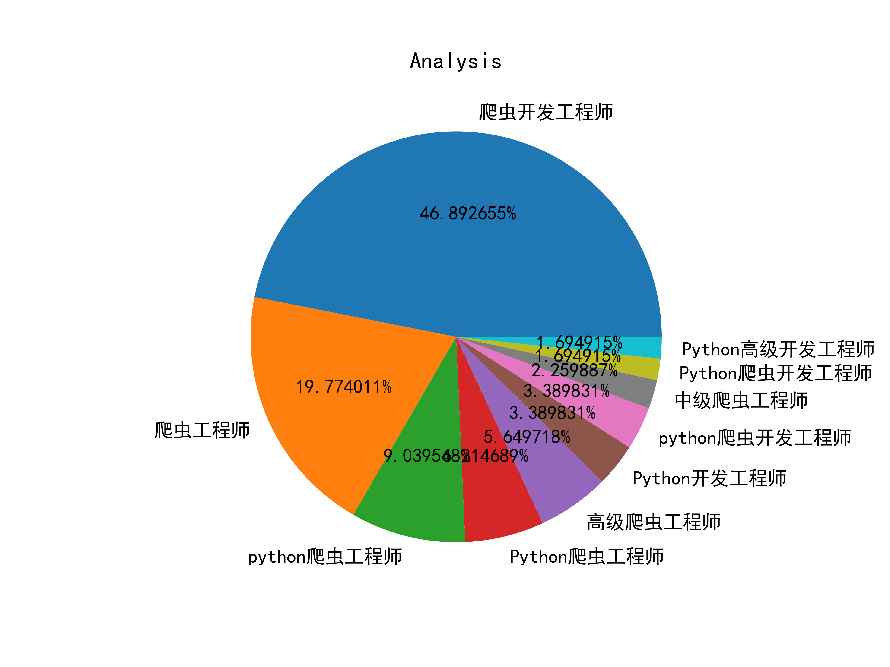
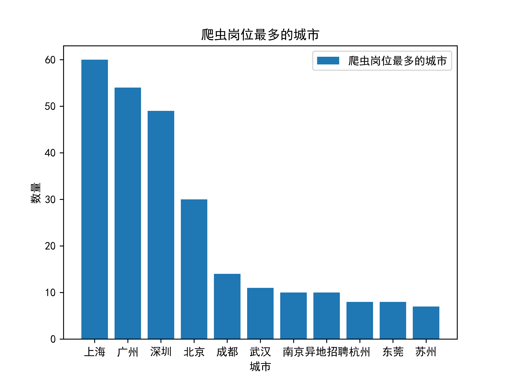
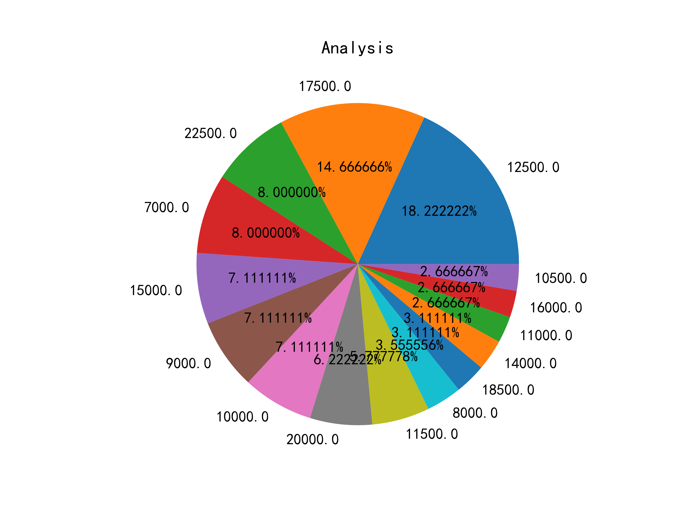
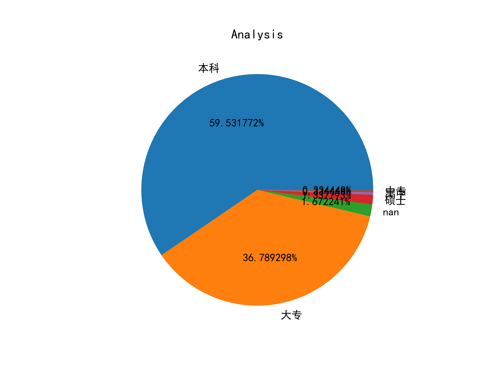

# readme

爬虫岗位数据分析

## 获取数据

分析目标网站

```shell
https://jobs.51job.com/pachongkaifa
```

分析标签，有公司，岗位，薪水等等，如下图



设置一个字典存放数据

```python
data = {
    "Job": list(),
    "Company": list(),
    "Location": list(),
    "Salary": list(),
    "Date": list(),
    "Education": list(),
    "Experience": list(),
    "Type": list(),
    "Scope": list(),
    "Detail": list(),
    "Url": list()
}
```

使用 css 选择器提取：

```python
# -*- coding:utf-8 -*-


import operator
import random
import time
import pandas
import requests
from pyquery import PyQuery
from collections import Counter
import matplotlib.pyplot as plt
import matplotlib

headers = {
    'Accept': 'text/html,application/xhtml+xml,application/xml;q=0.9,image/avif,image/webp,image/apng,*/*;q=0.8,application/signed-exchange;v=b3;q=0.9',
    'Accept-Encoding': 'gzip, deflate, br',
    'Accept-Language': 'en-US,en;q=0.9,zh-CN;q=0.8,zh;q=0.7',
    'Connection': 'keep-alive',
    'Cookie': 'guid=e8f41ae84347d0f2d43d72b5023d212d',
    'Host': 'jobs.51job.com',
    'sec-ch-ua': '" Not A;Brand";v="99", "Chromium";v="90", "Google Chrome";v="90"',
    'sec-ch-ua-mobile': '?0',
    'Sec-Fetch-Dest': 'document',
    'Sec-Fetch-Mode': 'navigate',
    'Sec-Fetch-Site': 'same-origin',
    'Sec-Fetch-User': '?1',
    'Upgrade-Insecure-Requests': '1',
    'User-Agent': 'Mozilla/5.0 (X11; Linux x86_64) AppleWebKit/537.36 (KHTML, like Gecko) Chrome/90.0.4430.85 Safari/537.36'
}

PAGE_NUM = 15


def list_helper(content: str):
    """

    :param content:
    :return:
    """
    content_list = content.split("：")
    if len(content_list) < 2:
        return "Empty"
    else:
        return content_list[1]


def gain_data():
    """

    :return:
    """
    for i in range(1, PAGE_NUM + 1):
        time.sleep(random.randint(5, 9))
        url = "https://jobs.51job.com/pachongkaifa/p" + str(i)
        r = requests.get(url, headers=headers)
        r.encoding = "gbk"
        content = PyQuery(r.text)(".detlist.gbox").children("div")
        for d in content.items():
            info = d(".info span").text().split(" ")
            data["Job"].append(d(".info .title").text())
            data["Company"].append(d(".info a").text().split(" ")[-1])
            data["Location"].append(info[-3])
            data["Salary"].append(info[-2])
            data["Date"].append(info[-1])
            order = d(".order").text().split("|")
            data["Education"].append(list_helper(order[0]))
            data["Experience"].append(list_helper(order[1]))
            data["Type"].append(list_helper(order[2]))
            data["Scope"].append(list_helper(order[3]))
            data["Detail"].append(d(".text").text().replace(" ", "", -1))
            data["Url"].append(d(".info span a").attr("href"))
    pandas.DataFrame(data).to_csv("resource/qcwy/data.csv")
```

共 15 页，将数据写入 csv 文件



## 数据分析

对工资做一些处理

```python
def analysis_helper(salary: str):
    """

    :param salary:
    :return:
    """

    def h(s: str):
        """

        :param s:
        :return:
        """
        num = 0
        if s.find("-") != -1:
            if s.find("万") != -1:
                s = s.replace("万", "", -1)
                s = s.split("-")
                num = (float(s[0]) + float(s[1])) / 2 * 10000
            elif s.find("千") != -1:
                s = s.replace("千", "", -1)
                s = s.split("-")
                num = (float(s[0]) + float(s[1])) / 2 * 1000
        else:
            if s.find("万") != -1:
                s = s.replace("万", "", -1)
                num = float(s) * 10000
            elif s.find("千") != -1:
                s = s.replace("千", "", -1)
                num = float(s) * 1000
        return num

    ss = salary.split("/")
    if ss[1] == "月":
        return h(ss[0])
    elif ss[1] == "年":
        return h(ss[0]) / 12
    elif ss[1] == "天":
        return h(ss[0]) * 20


if __name__ == '__main__':
    """"""
    # gain_data()
    d = pandas.read_csv("resource/qcwy/data.csv")
    job = list(d["Job"])
    location = list()
    salary = list()
    education = list(d["Education"])
    for s in list(d["Salary"]):
        salary.append(analysis_helper(s))
    for l in list(d["Location"]):
        if l.find("-") != -1:
            location.append(l.split("-")[0])
        else:
            location.append(l)
    ''''''
    # analysis_one(job)
    # analysis_two(location)
    # analysis_three(salary)
    # analysis_four(salary)
    analysis_five(education)
```

### 爬虫岗位常用名称

```python
def analysis_one(job: list):
    """

    :param job:
    :return:
    """
    top = 10
    job_tuple = sorted(dict(Counter(job)).items(), key=operator.itemgetter(1), reverse=True)[:top]
    k_list = list()
    v_list = list()
    for k, v in job_tuple:
        k_list.append(k)
        v_list.append(v)
    # k_list.append("其他")
    # v_list.append(len(job) - sum(v_list))
    plt.axes(aspect=1)
    plt.pie(x=v_list, labels=k_list, autopct='%0f%%')
    plt.title("Analysis")
    plt.savefig("resource/qcwy/r_1.png", dpi=600)
    plt.show()
```

效果图为



### 爬虫岗位最多的城市

```python
def analysis_two(location: list):
    """

    :param location:
    :return:
    """
    top = 11
    location_tuple = sorted(dict(Counter(location)).items(), key=operator.itemgetter(1), reverse=True)[:top]
    k_list = list()
    v_list = list()
    for k, v in location_tuple:
        k_list.append(k)
        v_list.append(v)
    plt.bar(k_list, v_list, label='爬虫岗位最多的城市')
    plt.legend()
    plt.xlabel('城市')
    plt.ylabel('数量')
    plt.title('爬虫岗位最多的城市')
    plt.savefig("resource/qcwy/r_2.png", dpi=600)
    plt.show()
```

效果图为



### 薪资分布情况

```python
def analysis_three(salary: list):
    """

    :param salary:
    :return:
    """
    top = 15
    salary_tuple = sorted(dict(Counter(salary)).items(), key=operator.itemgetter(1), reverse=True)[:top]
    k_list = list()
    v_list = list()
    for k, v in salary_tuple:
        k_list.append(k)
        v_list.append(v)
    # k_list.append("其他")
    # v_list.append(len(salary) - sum(v_list))
    plt.axes(aspect=1)
    plt.pie(x=v_list, labels=k_list, autopct='%0f%%')
    plt.title("Analysis")
    plt.savefig("resource/qcwy/r_3.png", dpi=600)
    plt.show()
```

效果图为



### 工资段

```python
def analysis_four(salary: list):
    """

    :param salary:
    :return:
    """
    data = pandas.DataFrame({"value": salary})
    cats1 = pandas.cut(data['value'].values, bins=[0, 5000, 10000, 15000, 20000, 30000, data['value'].max() + 1])
    pinShu = cats1.value_counts()
    pinshu_df = pandas.DataFrame(pinShu, columns=['频数'])
    pinshu_df['频率f'] = pinshu_df / pinshu_df['频数'].sum()
    pinshu_df['频率%'] = pinshu_df['频率f'].map(lambda x: '%.2f%%' % (x * 100))
    pinshu_df['累计频率f'] = pinshu_df['频率f'].cumsum()
    pinshu_df['累计频率%'] = pinshu_df['累计频率f'].map(lambda x: '%.4f%%' % (x * 100))
    print(pinshu_df)
```

结果为：

```text
                     频数       频率f     频率%     累计频率f      累计频率%
(0.0, 5000.0]         8  0.026846   2.68%  0.026846    2.6846%
(5000.0, 10000.0]    75  0.251678  25.17%  0.278523   27.8523%
(10000.0, 15000.0]  101  0.338926  33.89%  0.617450   61.7450%
(15000.0, 20000.0]   74  0.248322  24.83%  0.865772   86.5772%
(20000.0, 30000.0]   37  0.124161  12.42%  0.989933   98.9933%
(30000.0, 57501.0]    3  0.010067   1.01%  1.000000  100.0000%
```

### 学历要求

```python
def analysis_five(education: list):
    """

    :param education:
    :return:
    """
    education_tuple = sorted(dict(Counter(education)).items(), key=operator.itemgetter(1), reverse=True)[:]
    k_list = list()
    v_list = list()
    for k, v in education_tuple:
        k_list.append(k)
        v_list.append(v)
    # k_list.append("其他")
    # v_list.append(len(education) - sum(v_list))
    plt.axes(aspect=1)
    plt.pie(x=v_list, labels=k_list, autopct='%0f%%')
    plt.title("Analysis")
    plt.savefig("resource/qcwy/r_4.png", dpi=600)
    plt.show()
```

效果图为



当然，我们也可以利用这些数据作其他的分析

[源码](code/qcwy.py)